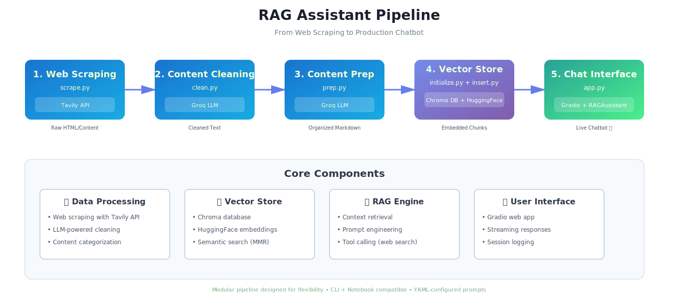

# RAG Assistant: Building a Complete Pipeline from Web Scraping to Chatbot

## TL;DR / Abstract
- Add more about why it matters

This project outlines the steps to get to get a RAG application up and running from any stage in the process, whether that be just an idea in your head, or you already have an organized vector database and just need an LLM interface to plug it into.  Below I'll give an overview of the point of this project and how it evolved

## Table of Contents
[Auto-generated links to sections]

## Overview

RAG is a method by which we split up documents into vector embeddings for storage in a vector database in order to provide context to a language model at run time to enrich its responses.  In this project we'll walk through each of the steps from the beginning.  We'll start with a simple method to scrape the web to get the raw material for your RAG pipeline.  Then we'll run through a couple LLM-powered methods to clean and organize the raw content.  Depending on the size of corpus you find, this could be a simple showcase of one of the benefits over RAG instead of putting everything in a prompt.  Then we'll walk through how to store this content into a vector database before topping it off with a demonstration with the stored text "Blueprints for Text Analytics in Python" using a Gradio interface.

The reason for that particular text is because I'm currently enrolled in a Masters for Data Science program at University of San Diego and taking a class called Applied Large Language Models for Data Science.  The original syllabus has called for two texts, the one above and another.  But unbeknowest to me, they revamped the syllabus and are now only requiring the other text.  Since I already had the Blueprints one, instead of letting it sit on my hard drive, I figured it would be put to better use in this project where Iu could still learn from it without worrying about reading the whole thing.

## Prerequisites
- Python 3.12.9 or higher
- Required API keys
  - LLM  
    This repo uses Langchain to wrap models, giving you flexibility in the model you choose.  It's currently set up using Groq as a provider, but can be easily switched to any  provider/model that Langchain supports
  - Tavily  
    Tavily is the web search application used for web search.  This is needed to enable the RAG Assistant to have the abilty to search the web.  It is also used for scraping the web for content for your vector database
  - HuggingFace  
    A HF log in is needed for the embedding models
- Basic understanding of: LLMs, vector databases, web APIs

## Project Overview & Architecture

High level overview of the steps in the pipeline.  It was designed to be modular so each step can be utilized in sequence or individually.

1) **ingestion**

    In the `ingestion/` directory you'll find three scripts: `scrape.py`, `clean.py`, `prep.py`.  All three can be utilized through the CLI or within a notebook

 - `scrape.py`  
    This script uses the Tavily web API to map and extract content from a root URL.  You first provide a root url that you want to start with, and the `.map()` method will extract every url it can find from that url to within a certain depth.  You can provide instructions to the mapper, change the maximum depth it'll search to (default is 5), or adjust any other parameter than the `.map()` accepts.  This will output a link of urls that can then be iterated through to extract their raw content via the `.extract()` method.  The result is a list of raw strings scraped from each url in the list

- `clean.py`  
    The resulting list of content will be messy.  There will be links to random images, html tags, lots of dead space, etc.  Instead of having to figure out every edge case to clean this up, we can leverage the power of LLM's.  This script first creates a list of message payloads for each string and then iterates through making calls to an LLM prompting it to clean up the raw string and returning just the content we're interested in.  This can be a costly process so messages that go beyond your rate limits are skipped.  Your chosen model is pinged first to get the rate limit for your account.  The final result is a single string with headers to denote individual sites.

- `prep.py`  
    After cleaning the strings, there is bound to be a lot of redundant and disorganized content.  So this step utilizes a language model to sort through the provided information, remove redundant and useless content, and organize the remaining into categories that would be useful for storage into a vector database.  These categories can be provided by you, or can be left to the LLM to decide.  The output will be a single string organized in Markdown format (important for the text splitting process)

2) **vector_store**

    There are two scripts here to `initialize` the vector store and `insert ` RAG material into it.  Like before, these scripts can be utilized through the CLI or imported into your notebook

- `initialize.py`  

## Installation & Setup
[Step-by-step environment setup]

## Pipeline Stages (Step-by-Step Instructions)

### Stage 1: Web Scraping (scrape.py)
- What it does
- Code snippets showing key functions
- CLI usage examples
- Notebook usage examples

### Stage 2: Content Cleaning (clean.py)
[Same structure for each stage...]

### Stage 3: Content Preparation (prep.py)

### Stage 4: Vector Store Setup (initialize.py + insert.py)

### Stage 5: Chat Application (app.py)

## Configuration & Customization
- YAML prompt system
- Modular components
- Extending for different use cases

## Testing & Validation
[Your integration testing approach]

## Troubleshooting
- Common errors
- API rate limits
- File path issues

## Future Directions
- Multi-agent orchestration plans
- Additional use cases

## Contributing

## License

## References & Resources

## Contact
